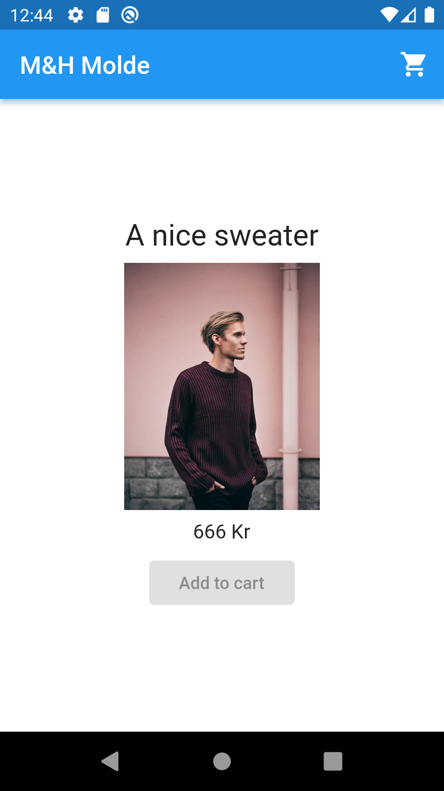
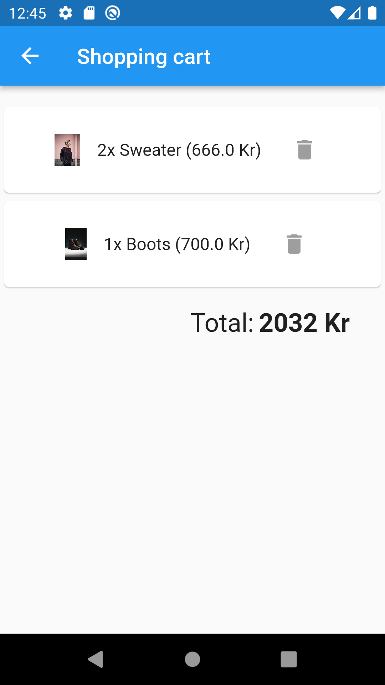

# Exercise E8

Repository for exercise E8.
Course [IDATA2503 Mobile applications](https://www.ntnu.edu/studies/courses/IDATA2503)
at [NTNU](https://ntnu.edu), campus [Aalesund](https://www.ntnu.edu/alesund).

## Intention

The intention with this exercise is to practice loading data from Cloud Firestore database provided
by the Firebase platform.

## Hand-in process

This is an optional exercise, you don't need to hand-in anything. However, we use GitHub classroom
as usually, you can clone the repo from there (see assignment link on Blackboard). This makes it
easier for teachers to get an overview of all repos, assist with coding help and commenting.

## Testing

No automated tests in this exercise.

## Solution

You can see a solution for this exercise on the
branch [`solution`](https://github.com/NTNU-MobileApps/exercise-e8-template/tree/solution).

## Background

Here in this repo you have a skeleton of a Flutter application. The UI is ready - it shows dummy
data. **Your task is to implement loading of the necessary data from Cloud Firestore and display it
in the UI.**

The first page shows a product page for a shop:



The app-bar shows the name of the shop, then it shows a single product: product title, image and
price. There is an "Add to cart" button, but we don't need it in this exercise.

On the top-right there is a shopping cart icon which takes the user to another screen



In the shopping cart page you see a list of items currently in the cart. Name, unit price and
quantity is displayed for each item. There is a "Remove from cart" button for each item as well, but
it is not needed in this exercise. At the bottom you see the total price of all items in the cart.

# Instructions

There is a ready-to-use Cloud Firestore database, with read-only access. This Flutter project is
configured with necessary keys for Android, web and iOS projects. (Yes, in real-world projects this
would be a security issue, but it is much easier to distribute the keys in this way for the
exercise, and this is a test-project anyway).

The database stores information about shops, products and shopping carts as three collections in the
following format:

```
shops:
  - 1:
      name: "Ålesund Klær"    
products:
  - 14:
      name:  Sneakers
      price: 25
      imageUrl: ...
  - 22:
      name: Blue Jeans
      price: 30
      imageUrl: ...
  - 72:
      name: Green T-shirt
      price: 17.2
      imageUrl:
shopping_carts:
  - user_42:
      totalPrice: 80
      items:
        - 1:
             name: Sneakers
             unit_price: 25
             quantity: 2
             imageUrl: ...
        - 2: 
             name: Blule Jeans
             unit_price: 30
             quantity: 1
             imageUrl: ...
```

Your task is to read data from the database and display it in the user interface of the app:

1. Display the shop name (Ålesund Klær) on the app-bar of product page (where "M&H Molde" is in the
   template).
2. Display data for a product on the product page: title, image, price. You can choose any of the
   products in the database.
3. Display shopping cart information (there is only one cart, for `user_42`):
    1. The total price of all items in the cart
    2. All the shopping cart items - the product name, unit_price and quantity

Hint: you probably want to define Streams for different nodes in the data-tree (different paths) and
connect those to the UI, using `StreamBuilder` widget.

If you want extra challenge, you can wrap the streams in Riverpod `StreamProvider` objects (instead
of `StreamBuilder`) 